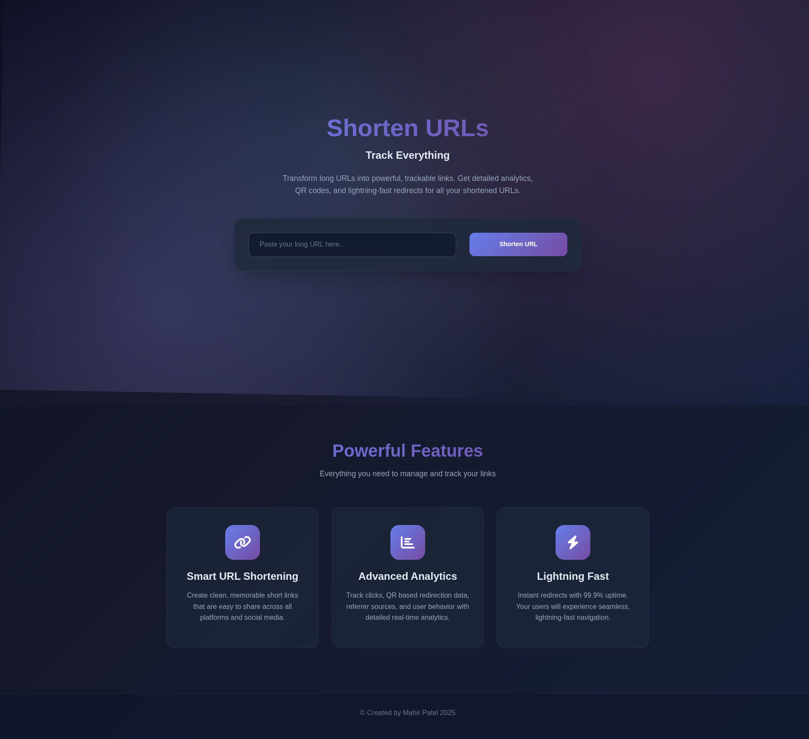
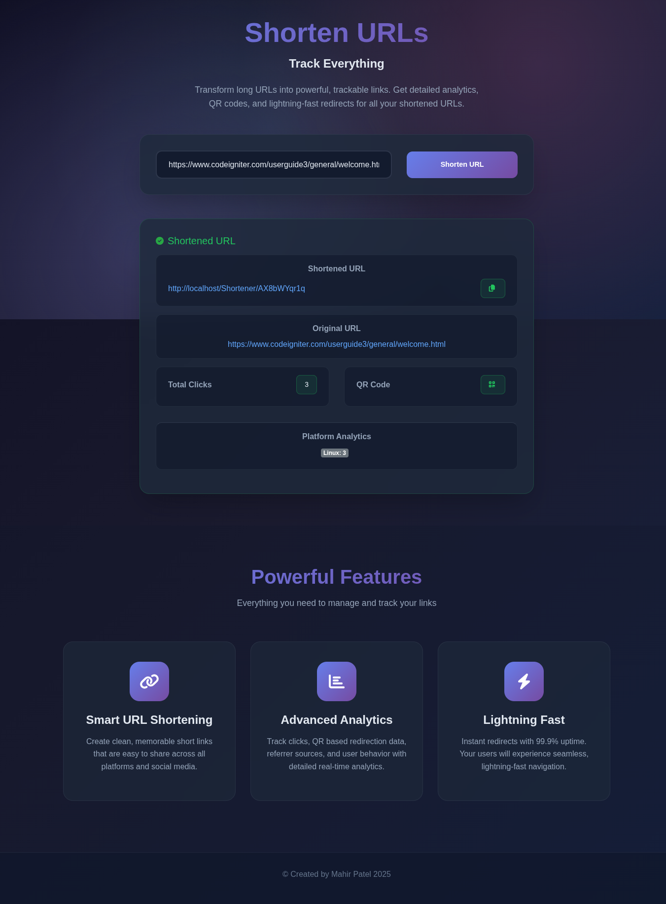

# 🔗 URL Shortener

**Transform long URLs into powerful, trackable links with advanced analytics**

[](https://github.com/MahirPatel/Shortener)
[](https://php.net/)
[](https://codeigniter.com/)
[](https://mysql.com/)
[](LICENSE)

## 📋 Overview

URL Shortener is a modern, feature-rich web application that converts long URLs into short, manageable links while providing comprehensive analytics and tracking capabilities. Built with CodeIgniter framework, it offers real-time click tracking, platform detection, referrer analysis, and QR code generation, making it perfect for marketers, developers, and businesses who need detailed insights into their link performance.

## ✨ Features

- 🔗 **Smart URL Shortening** - Generate clean, memorable short links with collision detection
- 📊 **Advanced Analytics** - Real-time click tracking with platform and referrer breakdown
- 📱 **Platform Detection** - Automatic identification of user devices (Android, iOS, Windows, macOS, Linux)
- 🌐 **Referrer Tracking** - Monitor traffic sources and referral patterns
- 📋 **QR Code Generation** - Downloadable QR codes for easy mobile sharing
- 🔄 **Duplicate Prevention** - Smart detection of existing URLs to avoid redundancy
- 📈 **Visual Dashboard** - Interactive analytics with badges and statistics
- 💾 **Persistent Storage** - MySQL database with comprehensive data retention
- 📱 **Responsive Design** - Modern UI that works seamlessly on all devices
- ⚡ **Lightning Fast** - Optimized redirects with 99.9% uptime performance
- 📋 **One-Click Copy** - Copy shortened URLs to clipboard instantly
- 🎨 **Modern Interface** - Dark theme with gradient backgrounds and smooth animations

## 🖼️ Screenshots

### Main Interface

*Clean, modern interface with URL shortening form and feature highlights*

### Results Overview

*Comprehensive analytics dashboard showing click statistics, platform breakdown, and QR code options*

## 🚀 Quick Start

### Requirements

- **PHP**: 5.3.7 or above (stable version recommended)
- **MySQL**: 5.7 or above
- **Web Server**: Apache/Nginx with mod_rewrite enabled
- **Browser**: Any modern stable browser with JavaScript enabled

### Installation

1. **Clone the repository**
   ```bash
   # Using HTTPS
   git clone https://github.com/MahirPatel/Shortener.git
   
   # Using SSH
   git clone git@github.com:MahirPatel/Shortener.git
   
   # Using GitHub CLI
   gh repo clone MahirPatel/Shortener
   ```

2. **Deploy to web server**
   ```bash
   # For Linux (move to html directory)
   sudo mv Shortener /var/www/html/
   
   # For Windows (move to htdocs directory)
   move Shortener C:\xampp\htdocs\
   ```

3. **Set permissions** (Linux only)
   ```bash
   sudo chown -R www-data:www-data /var/www/html/Shortener
   sudo chmod -R 755 /var/www/html/Shortener
   ```

4. **Create database**
   ```bash
   # Login to MySQL
   mysql -u root -p
   
   # Create database
   CREATE DATABASE shortener;
   
   # Import schema
   mysql -u root -p shortener < /var/www/html/Shortener/database/shortener.sql
   ```

5. **Configure database connection**
   ```php
   # Edit application/config/database.php
   $db['default'] = array(
       'hostname' => 'localhost',
       'username' => 'your_username',
       'password' => 'your_password',
       'database' => 'shortener',
       'dbdriver' => 'mysqli',
   );
   ```

6. **Access the application**
   ```
   http://localhost/Shortener
   ```

## 📖 Usage

### Step 1: Access the Application
Open your web browser and navigate to the URL Shortener installation URL.

### Step 2: Shorten a URL
1. Enter or paste your long URL in the input field
2. Click "Shorten URL" button or press Enter
3. Wait for the processing to complete
4. View your shortened URL in the results section

### Step 3: Analyze Results
- **Shortened URL**: Copy the generated short link
- **Original URL**: View the original long URL
- **Click Statistics**: Monitor total clicks in real-time
- **QR Code**: Download QR code for mobile sharing
- **Platform Analytics**: View device and platform breakdown

### Step 4: Track Performance
- **Real-time Updates**: Click counts update automatically
- **Platform Insights**: See which devices users prefer
- **Referrer Analysis**: Track traffic sources
- **Historical Data**: All data is stored permanently

### Step 5: Share and Monitor
- Use the copy button to share your shortened URL
- Download QR codes for offline marketing
- Monitor performance through the analytics dashboard

## 🏗️ Architecture

### Frontend
- **HTML5**: Semantic markup with accessibility features
- **CSS3**: Modern styling with animations and responsive design
- **JavaScript**: jQuery-based interactions with AJAX
- **Bootstrap 4**: Responsive grid system and components
- **Font Awesome**: Professional iconography

### Backend
- **CodeIgniter 3.x**: PHP MVC framework
- **MySQL**: Database with MySQLi driver
- **RESTful API**: JSON-based data exchange
- **Session Management**: Secure session handling

### File Structure
```
Shortener/
├── application/                # CodeIgniter application
│   ├── controllers/
│   │   └── Home.php           # Main controller with all functionality
│   ├── views/
│   │   └── home.php           # Main interface template
│   ├── config/
│   │   ├── config.php         # Application configuration
│   │   ├── database.php       # Database configuration
│   │   └── routes.php         # URL routing rules
│   └── [standard CI dirs]     # cache, models, libraries, etc.
├── assets/
│   ├── css/
│   │   └── style.css          # Custom styling
│   └── js/                    # JavaScript files
├── database/
│   └── shortener.sql          # Database schema
├── screenshot/                # UI screenshots
├── system/                    # CodeIgniter core files
├── .htaccess                  # URL rewriting rules
├── index.php                  # Application entry point
├── composer.json              # Dependencies
└── README.md                  # Project documentation
```

## 🗄️ Database Schema

### Table: `shortener_links`

```sql
CREATE TABLE `shortener_links` (
  `id` bigint NOT NULL AUTO_INCREMENT,
  `original_link` varchar(255) NOT NULL,
  `short_link` varchar(255) NOT NULL,
  `clicks` bigint NOT NULL DEFAULT '0',
  `clicksfrom` text NOT NULL,
  `created` timestamp NOT NULL DEFAULT CURRENT_TIMESTAMP,
  PRIMARY KEY (`id`)
) ENGINE=InnoDB DEFAULT CHARSET=utf8mb4;
```

**Field Descriptions:**
- `id`: Unique identifier for each shortened URL
- `original_link`: The original long URL
- `short_link`: Generated short code (hash)
- `clicks`: Total number of clicks/redirects
- `clicksfrom`: JSON data containing platform and referrer analytics
- `created`: Timestamp of URL creation

## 🔌 API Endpoints

### Create Shortened URL
**Endpoint**: `POST /Home/create`

**Request Format**:
```json
{
  "url": "https://example.com/very/long/url/path"
}
```

**Response Format**:
```json
{
  "original_link": "https://example.com/very/long/url/path",
  "short_link": "http://localhost/Shortener/abc123xyz",
  "clicks": 0,
  "clicksfrom": ""
}
```

### Redirect to Original URL
**Endpoint**: `GET /{shortCode}`

**Behavior**: Automatically redirects to original URL and increments click counter

### Download QR Code
**Endpoint**: `GET /Home/download_qr_code?url={shortUrl}`

**Response**: PNG image file download

## ⚙️ Configuration

### URL Rewriting
Ensure `.htaccess` is properly configured for clean URLs:
```apache
RewriteEngine on
RewriteCond %{REQUEST_FILENAME} !-f
RewriteCond %{REQUEST_FILENAME} !-d
RewriteRule .* index.php/$1 [PT,L]
```

### Database Settings
Configure your database connection in `application/config/database.php`:
```php
$db['default'] = array(
    'dsn' => '',
    'hostname' => 'localhost',
    'username' => 'root',
    'password' => 'your_password',
    'database' => 'shortener',
    'dbdriver' => 'mysqli',
    'char_set' => 'utf8',
    'dbcollat' => 'utf8_general_ci',
);
```

### Environment Settings
Set your environment in `index.php`:
```php
define('ENVIRONMENT', 'production'); // or 'development'
```

### Performance Notes
- **Hash Generation**: 10-character random strings with collision detection
- **Analytics Storage**: JSON format for flexible platform/referrer data
- **Caching**: Built-in CodeIgniter caching for optimal performance
- **Security**: XSS filtering and CSRF protection available

## 🛠️ Troubleshooting

### Common Issues

**Database Connection Failed**
- Verify database credentials in `application/config/database.php`
- Ensure MySQL server is running
- Check database name and user permissions

**404 Error on Short URLs**
- Verify `.htaccess` file is present and readable
- Enable `mod_rewrite` on Apache server
- Check file permissions on `.htaccess`

**QR Code Download Issues**
- Ensure internet connection for external QR API
- Check if `file_get_contents()` is enabled
- Verify URL encoding in QR code requests

**Analytics Not Showing**
- Check if `clicksfrom` field contains valid JSON
- Verify JavaScript is enabled in browser
- Clear browser cache and reload page

**URL Validation Errors**
- Ensure URLs include protocol (http:// or https://)
- Check for special characters in URLs
- Verify URL format meets validation criteria

## 🤝 Contributing

We welcome contributions from the community! Here's how you can help:

### Getting Started
1. **Fork the repository** to your GitHub account
2. **Clone your fork** locally:
   ```bash
   git clone https://github.com/YourUsername/Shortener.git
   ```
3. **Create a feature branch**:
   ```bash
   git checkout -b feature/your-feature-name
   ```

### Development Guidelines
- Follow CodeIgniter coding standards
- Test with sample URLs and different browsers
- Maintain responsive design principles
- Add comments for complex logic
- Ensure database queries are optimized

### Contribution Process
1. **Make your changes** in your feature branch
2. **Test thoroughly** with various URL formats
3. **Commit your changes** with clear, descriptive messages
4. **Push to your fork**:
   ```bash
   git push origin feature/your-feature-name
   ```
5. **Create a Pull Request** to the main repository

### Code Standards
- **PHP**: Follow CodeIgniter conventions and PSR standards
- **JavaScript**: Maintain jQuery coding style with proper error handling
- **CSS**: Use consistent naming and responsive design patterns
- **HTML**: Keep semantic structure and accessibility in mind

### What We're Looking For
- Bug fixes and performance improvements
- New analytics features
- UI/UX enhancements
- Security improvements
- Documentation updates
- Mobile optimization
- API enhancements

## 📄 License

This project is licensed under the MIT License - see the [LICENSE](LICENSE) file for details.

## 🆕 Changelog

### Version 1.0.0 (2025-01-XX)
- Initial release
- URL shortening with collision detection
- Real-time click tracking and analytics
- Platform and referrer detection
- QR code generation and download
- Responsive web interface
- MySQL database integration
- RESTful API endpoints
- Modern UI with animations
- Copy to clipboard functionality

## 📞 Support

- **Issues**: [GitHub Issues](https://github.com/MahirPatel/Shortener/issues)
- **Email**: mahirpatel9765@gmail.com

## 🙏 Acknowledgments

- Created by **Mahir Patel** (2025)
- Built with CodeIgniter framework
- QR Code generation powered by TEC-IT API
- Icons provided by Font Awesome
- UI components by Bootstrap

---

**Made with ❤️ for efficient link management**

*URL Shortener - Transform your links, track your success*